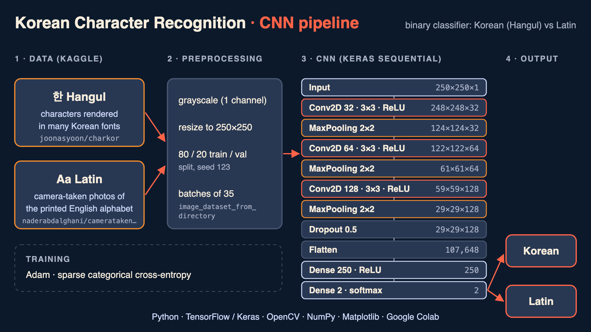

# Korean Character Recognition

A convolutional neural network (CNN) that classifies character images as **Korean (Hangul)** or **Latin**. Built with TensorFlow/Keras in Google Colab as a computer vision learning project.

## How it works

1. **Data**: two Kaggle datasets, one per class.
   - Hangul: [`joonasyoon/charkor`](https://www.kaggle.com/datasets/joonasyoon/charkor), Korean characters rendered in many fonts.
   - Latin: [`naderabdalghani/camerataken-images-of-printed-english-alphabet`](https://www.kaggle.com/datasets/naderabdalghani/camerataken-images-of-printed-english-alphabet), photos of printed English letters.
2. **Preprocessing**: images are loaded with `image_dataset_from_directory`, converted to grayscale and resized to 250x250, with an 80/20 train/validation split (seed 123) and batches of 35.
3. **Model**: three Conv2D + MaxPooling blocks (32, 64 and 128 filters, 3x3, ReLU), Dropout 0.5, Flatten, a Dense layer of 250 units and a 2-unit softmax output. Trained with Adam and sparse categorical cross-entropy.
4. **Prediction**: a new image is converted to grayscale, resized to 250x250 with OpenCV and passed to the saved model, which returns the predicted class.

## Notebooks

| Notebook | Description |
|---|---|
| [`RedNeuronal.ipynb`](RedNeuronal.ipynb) | Final pipeline: dataset setup, training of the Korean vs Latin classifier and prediction on a new image.  |
| [`KaggleTrial.ipynb`](KaggleTrial.ipynb) | Earlier experiments: dataset exploration and different class and font combinations.  |

## Tech stack

- **TensorFlow / Keras**: model definition and training.
- **OpenCV**: image loading, resizing and preprocessing.
- **NumPy**: numerical data handling.
- **Matplotlib**: visualizing sample images during training.

## Running it

1. Open `RedNeuronal.ipynb` in Google Colab.
2. Upload your own `kaggle.json` API token when prompted (never commit it).
3. Run the cells in order to download the datasets, train the model and test a prediction.

## Limitations and next steps

- Training runs were short (1 to 2 epochs) and there is no separate held-out test set.
- Pixel scaling is not consistent between training (0-255) and inference (0-1); adding a `Rescaling(1/255)` layer to the model would fix it.
- The two classes come from different sources (rendered fonts vs camera photos), so the model may learn the source instead of the script. Using the same kind of images for both classes would make the evaluation more reliable.
